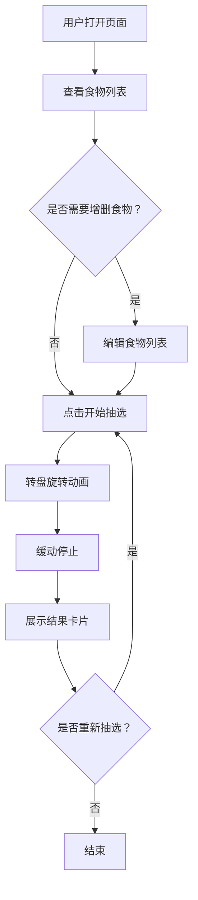

## 1. 产品概述

晚餐抽选器是一个趣味性单页应用，帮助"选择困难症"用户快速决定今晚吃什么。通过视觉化的转盘抽选动画和自定义食物列表，让每天"吃什么"的决策变得轻松有趣。

- 目标用户：日常纠结晚餐选择的都市人群
- 核心价值：用随机抽选消除决策疲劳，用动画体验增加趣味性

## 2. 核心功能

### 2.1 功能模块

1. **主页面**：转盘抽选区、食物列表管理、抽选结果展示

### 2.2 页面详情

| 页面名称 | 模块名称 | 功能描述 |
|---------|---------|---------|
| 主页面 | 转盘抽选区 | 中央大转盘，点击按钮旋转，随机停在某个食物上，带缓动动画效果 |
| 主页面 | 食物列表管理 | 展示当前所有可选食物，支持添加、删除食物项 |
| 主页面 | 抽选结果展示 | 转盘停止后弹出结果卡片，展示选中食物，带庆祝动画效果 |
| 主页面 | 历史记录 | 展示最近几次抽选结果，方便回顾 |

## 3. 核心流程

用户打开页面 → 查看当前食物列表（可增删）→ 点击"开始抽选"按钮 → 转盘旋转动画 → 缓动停止 → 展示结果卡片 → 可重新抽选或修改列表

## 4. 用户界面设计

### 4.1 设计风格

- **主色调**：暖橙色（#FF6B35）+ 深棕底色（#1A1210），营造温暖食欲感
- **辅助色**：奶油白（#FFF8F0）、焦糖色（#C4723A）
- **按钮风格**：圆润大按钮，带阴影和 hover 放大效果
- **字体**：标题使用 ZCOOL KuaiLe（站酷快乐体），正文使用 Noto Sans SC
- **布局风格**：居中单列布局，转盘为视觉焦点
- **图标风格**：使用食物相关 emoji 和 lucide-react 图标

### 4.2 页面设计概览

| 页面名称 | 模块名称 | UI 元素 |
|---------|---------|---------|
| 主页面 | 转盘抽选区 | 圆形转盘、分区色块、中心按钮、旋转动画、缓动停止效果 |
| 主页面 | 食物列表管理 | 标签式食物项、添加输入框、删除按钮、滑入动画 |
| 主页面 | 抽选结果展示 | 模态卡片、放大弹入动画、食物名称、庆祝粒子效果 |
| 主页面 | 历史记录 | 底部横向滚动列表、时间戳、食物名称 |

### 4.3 响应式设计

- 桌面优先设计，转盘尺寸自适应
- 移动端转盘缩小，列表改为折叠面板
- 触摸优化：按钮足够大，转盘支持触摸点击

### 4.4 动效设计

- 转盘旋转：CSS transform rotate，带 cubic-bezier 缓动
- 结果展示：scale + opacity 弹入动画
- 食物标签添加/删除：滑入滑出过渡
- 背景：微妙的渐变流动动画
