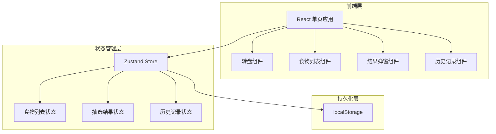
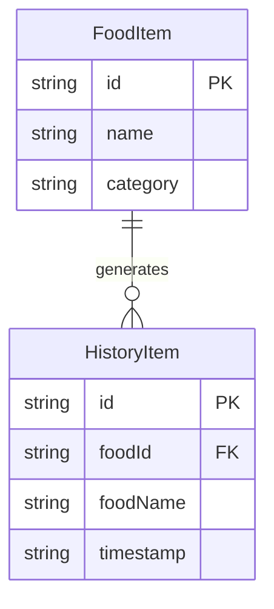

## 1. 架构设计



## 2. 技术说明

- 前端：React@18 + TypeScript + Tailwind CSS@3 + Vite
- 初始化工具：vite-init
- 状态管理：Zustand
- 后端：无（纯前端应用）
- 数据持久化：localStorage

## 3. 路由定义

| 路由 | 用途 |
|------|------|
| / | 主页面，包含转盘、食物管理、结果展示 |

## 4. 数据模型

### 4.1 数据模型定义



### 4.2 数据定义

```typescript
interface FoodItem {
  id: string;
  name: string;
  category: string;
}

interface HistoryItem {
  id: string;
  foodName: string;
  timestamp: string;
}

interface AppState {
  foods: FoodItem[];
  history: HistoryItem[];
  currentResult: FoodItem | null;
  isSpinning: boolean;
}
```

### 4.3 初始数据

预设食物列表（中餐为主）：
- 火锅、烧烤、麻辣烫、炒菜、饺子、面条、汉堡、披萨、寿司、沙拉、煲仔饭、螺蛳粉、黄焖鸡、兰州拉面、麻辣香锅
